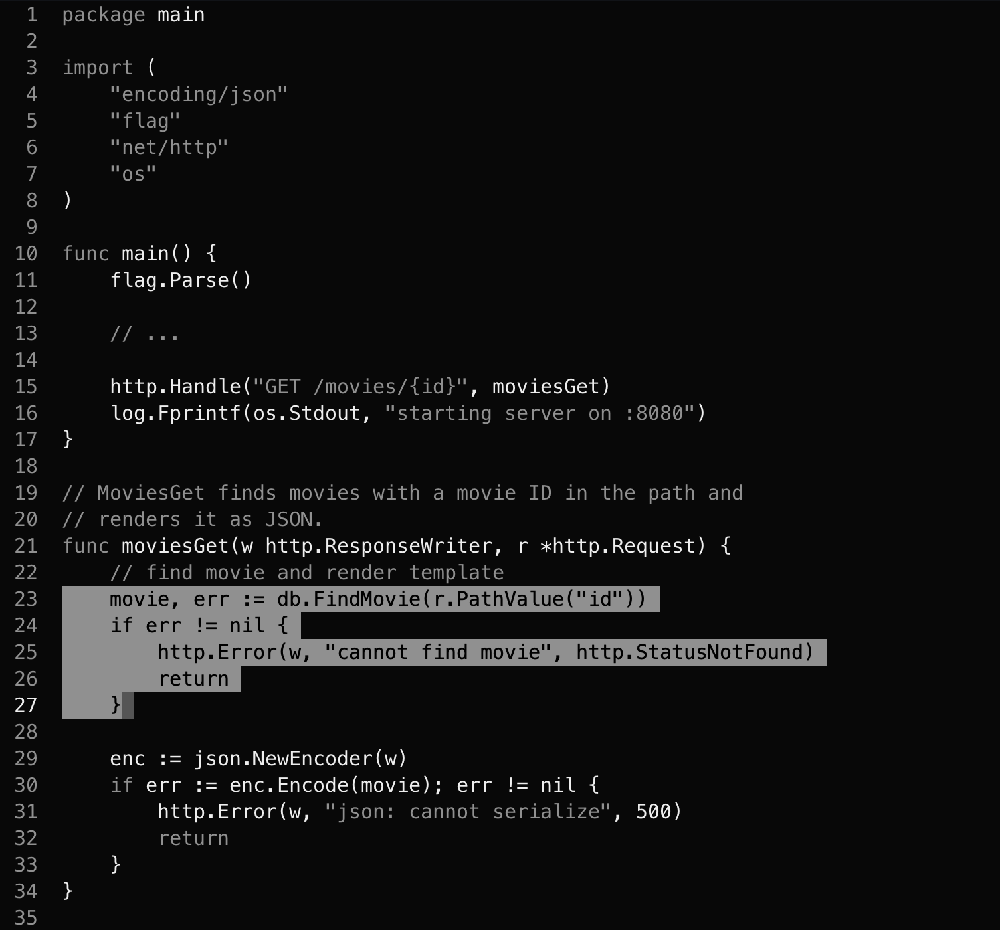

<p align="center">
  
</p>

# Grayscale

A grayscale theme made for relaxed and focused coding.

## Philosophy

When coding attention should be focused on the code itself. Bright and colorful
themes can reduce concentration for some people.

Code isn't all one big block, however, so this theme eases the eye towards the
important parts by reducing contrast on tokens that are not always important
such as common keywords, comments, etc.

## Installation

Helix themes reside on the config directory, usually at
`$HOME/.config/helix/themes/`. Simply copy the file `themes/grayscale.toml` to
your themes directory however you want:

```shell
$ git clone https://github.com/dlisboa/helix-grayscale.git
$ cp helix-grayscale/themes/grayscale.toml $HOME/.config/helix/themes/
```

## Usage

After installing, add the theme to your helix config, e.g. `$HOME/.config/helix/config.toml`:

```toml
theme = "grayscale"
```

## Contributing

Contributions are welcome. No huge process here, just open up an issue/PR.

## License

See `LICENSE`.
